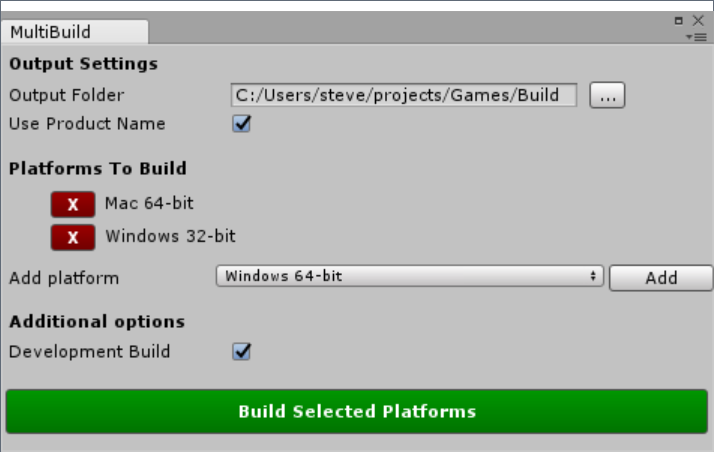

# Unity MultiBuild

## What it does

Provides you with a simple in-editor interface to build for multiple platforms
at once.



## How to use (Interactive)

1. From the menu, click `Tools` > `MultiBuild...`
1. Choose a base output folder (each platform will build into a subfolder)
1. Add the platforms you want to build for
1. Click the green build button

## How to use (Command line)

### Option 1: Build using all settings last saved in UI

```
Unity -quit -batchmode -executeMethod MultiBuild.Builder.Build
```

This invokes MultiBuild using all the settings you specified when you last used
the UI (you have to have used it at least once or this will fail). Includes
the output folder, the targets you picked, and whether it was development mode etc.

### Option 2: Build using settings specified on command line

```
Unity -quit -batchmode -executeMethod MultiBuild.Builder.BuildCommandLine <outputFolder> <is_dev> <targetName> [targetName...]
```

In this mode you specify the output folder, whether to build in development mode
(just a 'true' or 'false'), and a list of targets, which must match the
entries in the `Target` enum in [Settings.cs](Assets/MultiBuild/Editor/Settings.cs),
e.g. "Win64".

This mode is useful because there is no standard way to build a development mode player
in Unity from the command line right now.

## More details

* The scenes that are built are the ones you've selected in Build Settings
* By default the project name is used as a base for all output, but you can
  disable that and provide a different name if you like
* Your settings are saved in your project at `Assets/MultiBuild/MultiBuildSettings.asset`
* After finishing the build, the active target is reset to whatever it was before
  you started the build
* Be aware that I've only really tested this with the standalone builds right now

## Why?

I often build for several platforms and found it tedious to keep switching in
the Build Settings window. It was useful to me to be able to build both with
the Unity editor still open (you can't use the command line build when it's open),
and to be able to use the saved settings from the command line.

Even if you use the full command line mode where you specify all the targets, it's
simpler when using a lot of targets (shared base folder, automatic subfolders),
plus you can also change the "Development mode" flag with this tool, which you
cannot with the vanilla Unity command line build.

## Contributing

I'm not going to be spending loads of time on this so if you want a new feature
or you find a problem with one of the targets (or want to add more of them),
please fork and submit a pull request in the first instance. All contributions
welcome!

## License (MIT)

Copyright © 2017 Steve Streeting

Permission is hereby granted, free of charge, to any person obtaining a copy
of this software and associated documentation files (the "Software"), to deal
in the Software without restriction, including without limitation the rights
to use, copy, modify, merge, publish, distribute, sublicense, and/or sell
copies of the Software, and to permit persons to whom the Software is
furnished to do so, subject to the following conditions:
The above copyright notice and this permission notice shall be included in
all copies or substantial portions of the Software.

THE SOFTWARE IS PROVIDED "AS IS", WITHOUT WARRANTY OF ANY KIND, EXPRESS OR
IMPLIED, INCLUDING BUT NOT LIMITED TO THE WARRANTIES OF MERCHANTABILITY,
FITNESS FOR A PARTICULAR PURPOSE AND NONINFRINGEMENT. IN NO EVENT SHALL THE
AUTHORS OR COPYRIGHT HOLDERS BE LIABLE FOR ANY CLAIM, DAMAGES OR OTHER
LIABILITY, WHETHER IN AN ACTION OF CONTRACT, TORT OR OTHERWISE, ARISING FROM,
OUT OF OR IN CONNECTION WITH THE SOFTWARE OR THE USE OR OTHER DEALINGS IN
THE SOFTWARE.


